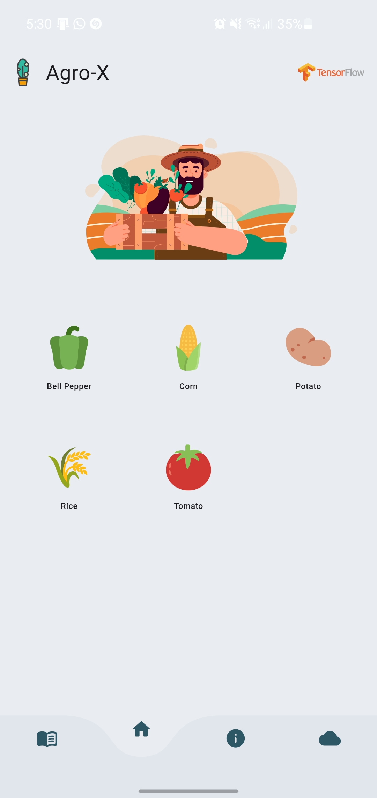
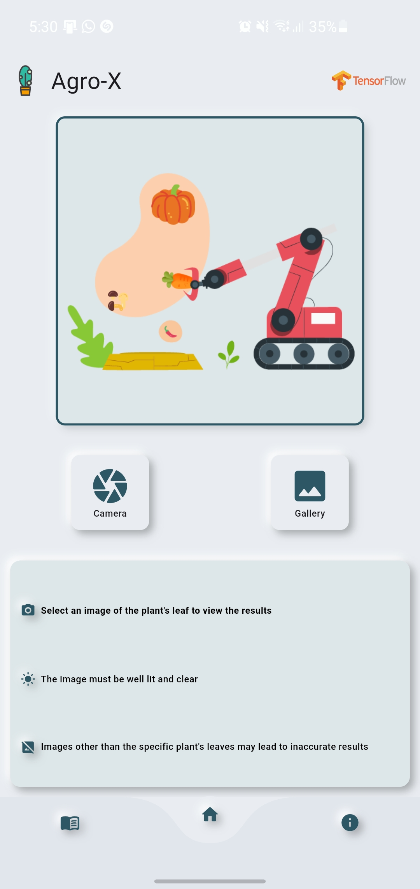
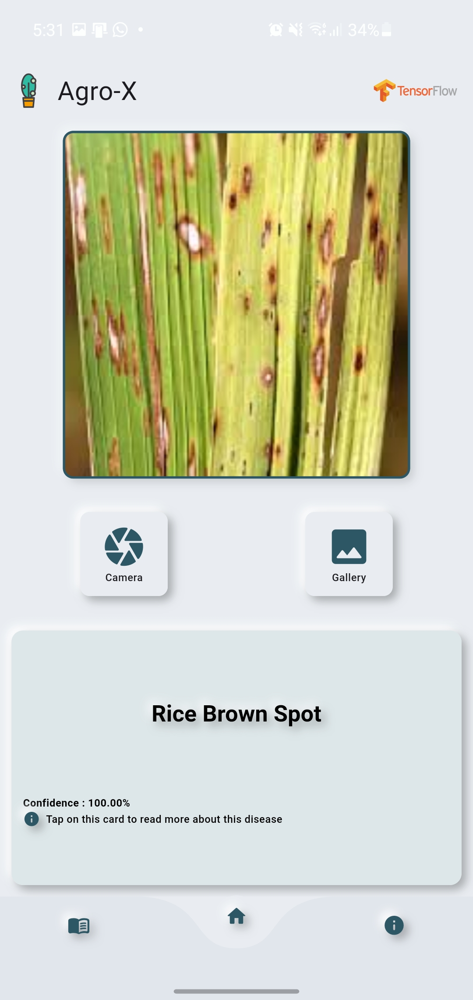
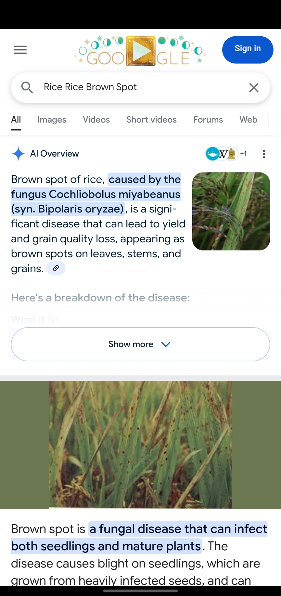
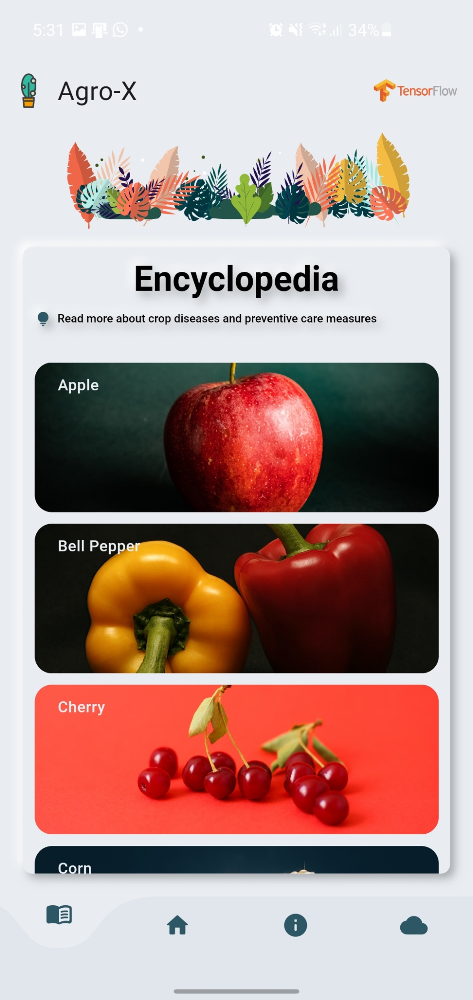

# AgroX V-II
# 🌿 Plant Disease Detection App  

## 🚀 Overview  
This application helps users detect plant diseases by uploading images. It provides disease identification, treatment recommendations, and an encyclopedia of plant diseases.  

## ✨ Features  
✅ **Image Upload** – Users can upload plant images for analysis.  
🤖 **Disease Detection** – AI-powered identification of plant diseases.  
💡 **Recommendations** – Get treatment suggestions for detected diseases.  
📚 **Encyclopedia** – Browse detailed information on plant diseases.  
ℹ️ **About Us** – Learn more about the project and its contributors.  

## 📸 Screenshots  
### 🏡 Landing Page  
  

### 📤 Image Upload  
  

### 🔍 Disease Detection  
  

### 💊 Recommendations  
  

### 📖 Encyclopedia  
  

### 👥 About Us  
  

## 📥 Download  
📂 You can download the full application from Google Drive:  
👉 [Download Here]([https://drive.google.com/file/d/1oCdinBih9A3W5i2Tq5WwDHPmwtOjqbTO/view?usp=sharing])  

## 🛠 Installation & Usage  
1. Clone the repository:  
   ```sh
   git clone https://github.com/your-username/your-repo-name.git
   cd your-repo-name
2. Install Dependencies:
   ```sh
   flutter pub get
 3. Run the application following the setup guide

## 📜License

This project is open-source and available under the MIT License.

🌱 Happy Planting & Stay Green! 🌿
